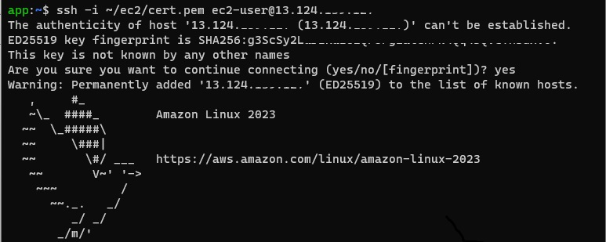
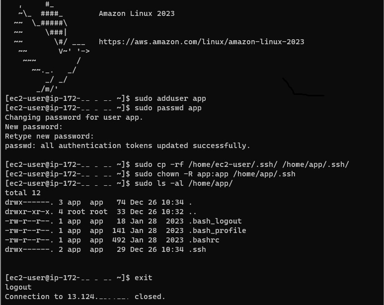
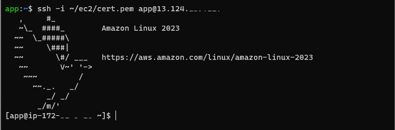

# AWS-K8S

### Initialize EC2 instance
> After running wsl, copy the 'cert.pem' file for aws ec2 to any wsl's directory then connect to instance. 
```
app:~$ ssh -i ~/ec2/cert.pem ec2-user@10.0.0.1
```


> Create new account and initialize it.
```
[ec2-user@ip-10-0-0-1 ~]$ sudo adduser app
[ec2-user@ip-10-0-0-1 ~]$ sudo passwd app
Changing password for user app.
New password:
Retype new password:
passwd: all authentication tokens updated successfully.

[ec2-user@ip-10-0-0-1 ~]$ sudo cp -rf /home/ec2-user/.ssh/ /home/app/.ssh/
[ec2-user@ip-10-0-0-1 ~]$ sudo chown -R app:app /home/app/.ssh

[ec2-user@ip-10-0-0-1 ~]$ sudo visudo
...
## The COMMANDS section may have other options added to it.
## Allow root to run any commands anywhere
root    ALL=(ALL)       ALL
app     ALL=(ALL)       ALL
...
```


> Connect new account.
```
app:~$ ssh -i ~/ec2/cert.pem app@10.0.0.1
```


> To register profile in Windows Terminal, use the below command line.
```
C:\Windows\system32\wsl.exe ssh -i /home/app/ec2/cert.pem app@10.0.0.1
```


### Pre-Setting
All instances including master and worker.
```
$ sudo swapoff -a
$ sudo sed -i '/swap/s/^/#/' /etc/fstab

$ sudo vi /etc/sysctl.d/custom-ip-forwarding.conf
net.ipv4.ip_forward=1

$ sudo sysctl -p
...
```

## Install Docker
Install Docker and cri-dockerd on all instances.

### [Installing Docker to use with the AWS SAM CLI](https://docs.aws.amazon.com/serverless-application-model/latest/developerguide/install-docker.html)
For Amazon Linux 2023, run the following::
```
$ sudo yum update -y
$ sudo yum install -y docker
$ sudo service docker start
$ sudo usermod -a -G docker app
$ docker ps
```

### [Install cri-dockerd](https://github.com/Mirantis/cri-dockerd)
The easiest way to install cri-dockerd is to use one of the pre-built binaries or packages from the [releases page](https://github.com/Mirantis/cri-dockerd/releases).
```
$ VER=$(curl -s https://api.github.com/repos/Mirantis/cri-dockerd/releases/latest|grep tag_name | cut -d '"' -f 4|sed 's/v//g'); echo $VER
$ wget https://github.com/Mirantis/cri-dockerd/releases/download/v${VER}/cri-dockerd-${VER}.amd64.tgz
$ tar xvf cri-dockerd-${VER}.amd64.tgz
$ sudo mv cri-dockerd/cri-dockerd /usr/local/bin/

$ sudo cri-dockerd --version

$ wget https://raw.githubusercontent.com/Mirantis/cri-dockerd/master/packaging/systemd/cri-docker.service
$ wget https://raw.githubusercontent.com/Mirantis/cri-dockerd/master/packaging/systemd/cri-docker.socket
$ sudo mv cri-docker.socket cri-docker.service /etc/systemd/system/
$ sudo sed -i -e 's,/usr/bin/cri-dockerd,/usr/local/bin/cri-dockerd,' /etc/systemd/system/cri-docker.service

$ sudo systemctl daemon-reload
$ sudo systemctl enable cri-docker.service
$ sudo systemctl enable --now cri-docker.socket

$ sudo systemctl restart docker && sudo systemctl restart cri-docker
$ sudo systemctl status cri-docker.socket --no-pager 

$ sudo mkdir /etc/docker
$ cat <<EOF | sudo tee /etc/docker/daemon.json
{
  "exec-opts": ["native.cgroupdriver=systemd"],
  "log-driver": "json-file",
  "log-opts": {
    "max-size": "100m"
  },
  "storage-driver": "overlay2"
}
EOF

$ sudo systemctl restart docker && sudo systemctl restart cri-docker
$ sudo docker info | grep Cgroup

$ cat <<EOF | sudo tee /etc/modules-load.d/k8s.conf
br_netfilter
EOF

$ cat <<EOF | sudo tee /etc/sysctl.d/k8s.conf
net.bridge.bridge-nf-call-ip6tables = 1
net.bridge.bridge-nf-call-iptables = 1
EOF

$ sudo sysctl --system
```


